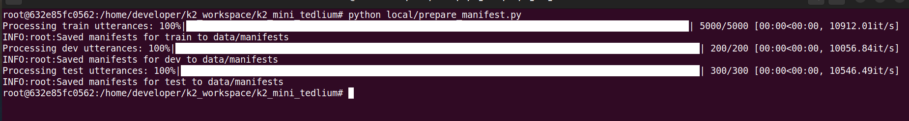
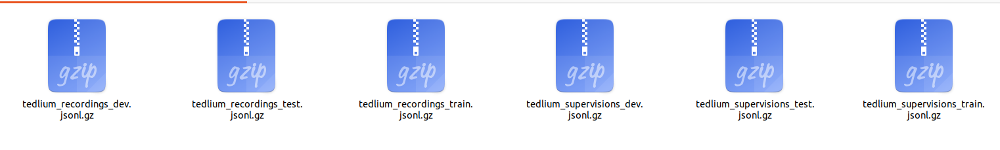
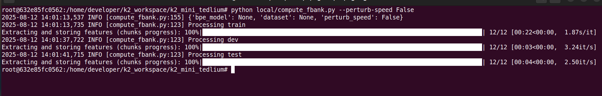
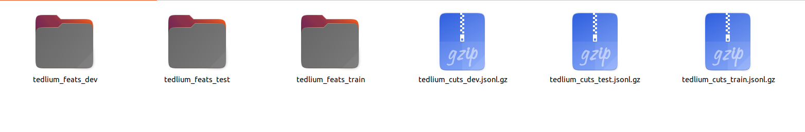
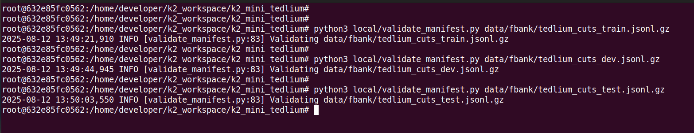
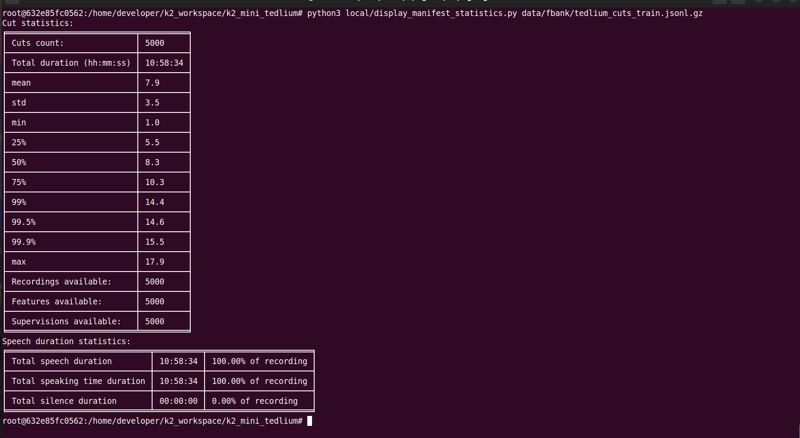
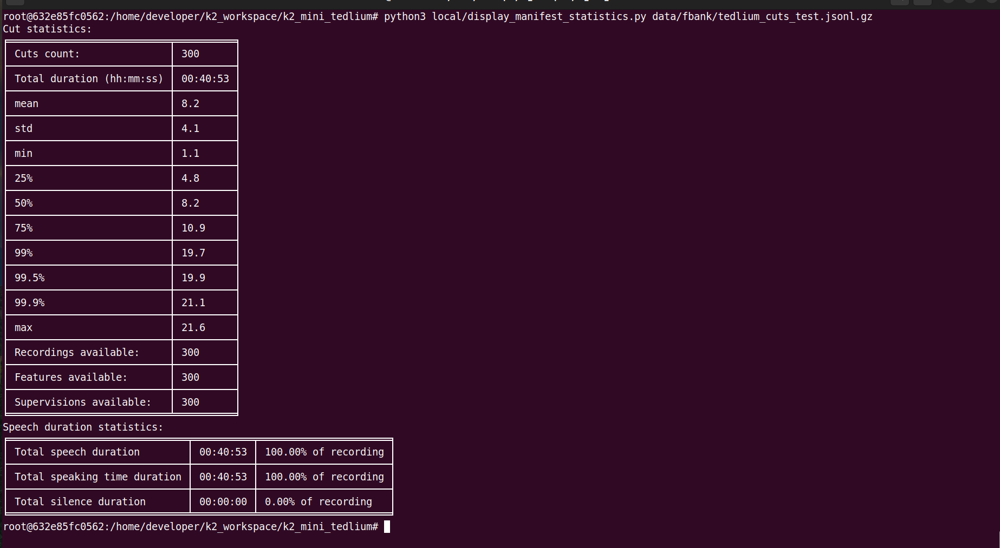
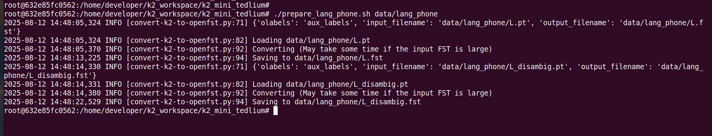
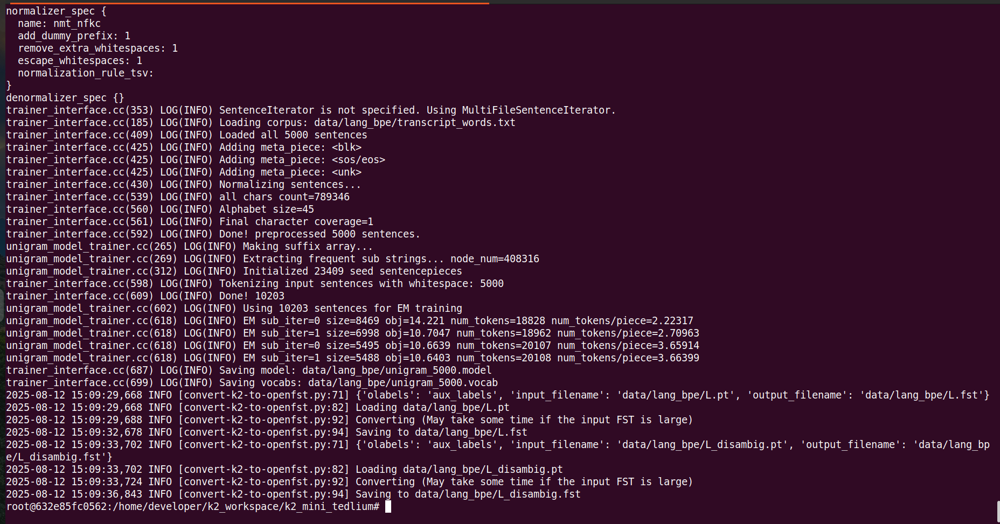

# ASR System building using K2

**Author: Abhishek Dey**

## About:

In this work, an ASR system is built using next-gen kaldi known as [k2-icefall](https://github.com/k2-fsa/icefall/tree/master). The focus of this work is to get a hands-on understanding of the k2 setup on a sample dataset. A subset of [Tedlium dataset](https://www.openslr.org/7/) is taken out for experimental purpose. The train, dev and test sets have 5000, 200 and 300 examples respectively.

## Docker environment

### Docker pull

```
sudo docker image pull k2fsa/icefall:torch1.13.0-cuda11.6

```

### Docker run

```
docker run --gpus 0 -e NVIDIA_VISIBLE_DEVICES=0 --shm-size 4G -it --rm -v $PWD:/home/developer  k2fsa/icefall:torch1.13.0-cuda11.6

```

### Update the code

```
cd /workspace/icefall

git pull

```

## Building an ASR system:

* Create a workspace 

```
mkdir -p k2_asr_workspace

```

* Copy all the scripts from [k2-scripts](k2-scripts) to **k2_asr_workspace**

```

cp -r k2-scripts/* k2_asr_workspace

cd k2_asr_workspace

```


## Dataset:

* Download **tedlium_mini_dataset** into  **k2_asr_workspace** : [Google drive link](https://drive.google.com/file/d/1CqQIpvlkuTWWHcpiXErlm4IaSpk-3XxE/view?usp=drive_link)

* unzip dataset

```

unzip tedlium_mini_dataset.zip

```


### copy kaldi style data folder

```

cp -r tedlium_mini_dataset/data/ ./

```

## 1. Prepare manifest

```
python local/prepare_manifest.py

```

<p align="left">

</p>


<p align="left">

</p>

## 2. Compute f-bank features

```
python local/compute_fbank.py --perturb-speed False

```

<p align="left">

</p>


<p align="left">

</p>


## 3. Validate manifest

```

python3 local/validate_manifest.py data/fbank/tedlium_cuts_train.jsonl.gz

python3 local/validate_manifest.py data/fbank/tedlium_cuts_dev.jsonl.gz

python3 local/validate_manifest.py data/fbank/tedlium_cuts_test.jsonl.gz

```

<p align="left">

</p>

## 4. Display manifest statistics

* train

```
python3 local/display_manifest_statistics.py data/fbank/tedlium_cuts_train.jsonl.gz

```

<p align="left">

</p>

* dev

```
python3 local/display_manifest_statistics.py data/fbank/tedlium_cuts_dev.jsonl.gz

```

<p align="left">

</p>

* test

```
python3 local/display_manifest_statistics.py data/fbank/tedlium_cuts_test.jsonl.gz

```

<p align="left">

</p>


## 5. Prepare phone based lang

* create data/lang_phone directory

```
mkdir -p data/lang_phone

```

* copy lexicon

```
cp tedlium_mini_dataset/lexicon.txt data/lang_phone/

```

* Add the following to the lexicon if not added

```
!SIL SIL
<SPOKEN_NOISE> SPN
<UNK> SPN

```

* manually remove if any

```

!SIL sil

```

* run prepare_lang_phone.sh

```
./prepare_lang_phone.sh data/lang_phone

```

<p align="left">

</p>


## 6. Prepare BPE based lang

* create data/lang_bpe_500 directory

```
mkdir -p data/lang_bpe_500

```

* copy train transcription

```
cp data/train/trans data/lang_bpe_500/transcript_words.txt

```

* copy words.txt from data/lang_phone to data/lang_bpe_500

```
cp data/lang_phone/words.txt data/lang_bpe_500/

```

* run prepare_lang_bpe.sh 

```
./prepare_lang_bpe.sh data/lang_bpe_500 500

```

<p align="left">

</p>

## 7. Prepare P


* Generate transcript_tokens.txt

```
python3 local/convert_transcript_words_to_tokens.py --lexicon data/lang_bpe_500/lexicon.txt --transcript data/lang_bpe_500/transcript_words.txt --oov "<UNK>" > data/lang_bpe_500/transcript_tokens.txt

```
* Generate P.arpa

```

python3 shared/make_kn_lm.py -ngram-order 2 -text data/lang_bpe_500/transcript_tokens.txt -lm data/lang_bpe_500/P.arpa

```
* Generate P.fst.txt

```

python3 -m kaldilm --read-symbol-table="data/lang_bpe_500/tokens.txt" --disambig-symbol='#0' --max-order=2 data/lang_bpe_500/P.arpa > data/lang_bpe_500/P.fst.txt
    
```

## 8. Prepare G

```
mkdir -p data/lm

```

* Generate G_3_gram.arpa

``` 
python3 shared/make_kn_lm.py -ngram-order 3 -text data/train/trans -lm data/lm/G_3_gram.arpa 
 
```

* Generate G_3_gram.fst.txt

```

python3 -m kaldilm --read-symbol-table="data/lang_phone/words.txt" --disambig-symbol='#0' data/lm/G_3_gram.arpa > data/lm/G_3_gram.fst.txt

```

* Generate G_4_gram.arpa

``` 
python3 shared/make_kn_lm.py -ngram-order 4 -text data/train/trans -lm data/lm/G_4_gram.arpa 
 
```
* Generate G_4_gram.fst.txt

```

python3 -m kaldilm --read-symbol-table="data/lang_phone/words.txt" --disambig-symbol='#0' data/lm/G_4_gram.arpa > data/lm/G_4_gram.fst.txt

```

## 9. Compile HLG


```

python3 local/compile_hlg.py --lang-dir data/lang_phone

python3 local/compile_hlg.py --lang-dir data/lang_bpe_500

```

<p align="left">

</p>


## Zipformer

* Training

```
./zipformer/train.py --use-fp16 true --world-size 1 --num-epochs 30 --start-epoch 1 --exp-dir zipformer/exp --max-duration 50 --enable-musan False --bpe-model data/lang_bpe_500/bpe.model --base-lr 0.001

```
* Decoding

```

./zipformer/decode.py --exp-dir zipformer/exp --bpe-model data/lang_bpe_500/bpe.model --lang-dir data/lang_bpe_500 --epoch 30 --avg 5 --max-duration 50 --decoding-method greedy_search

```
