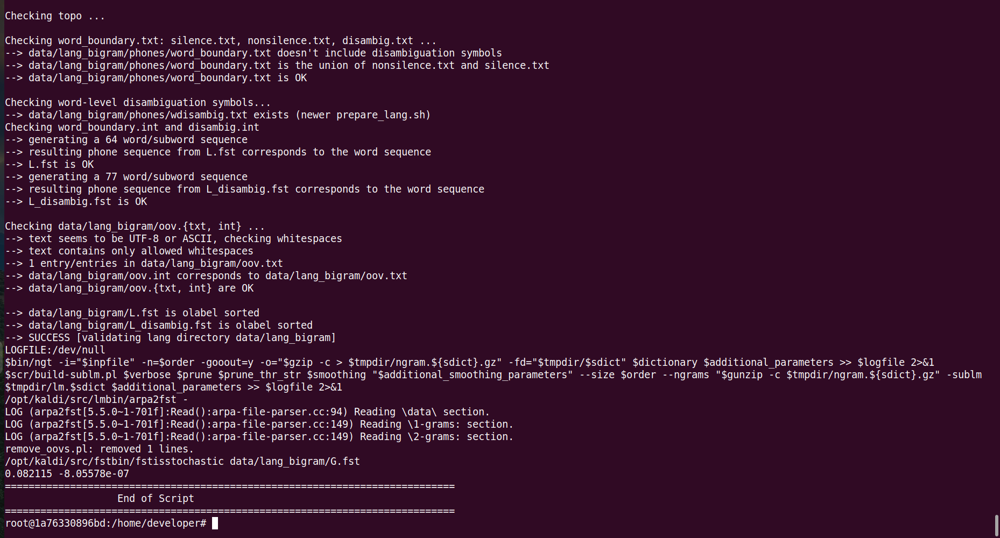
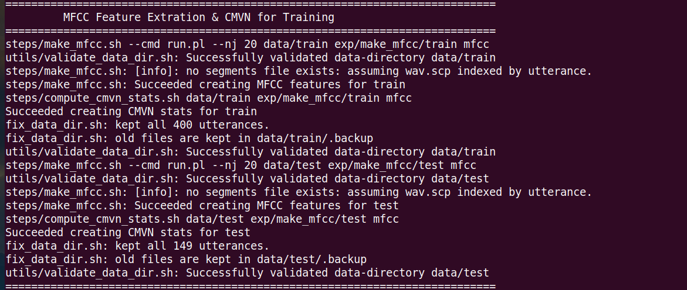
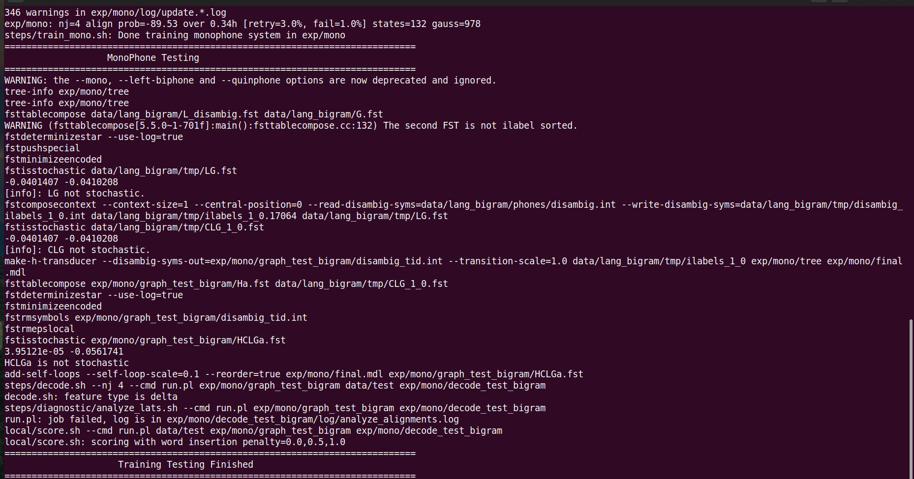
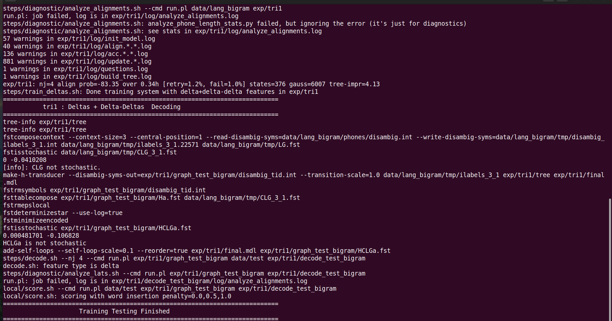
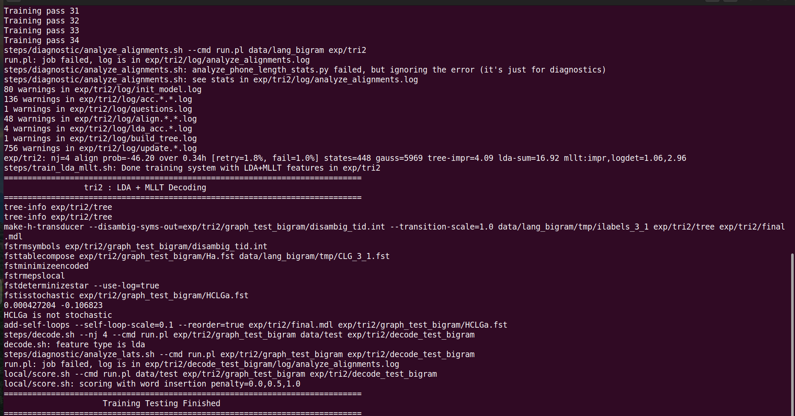
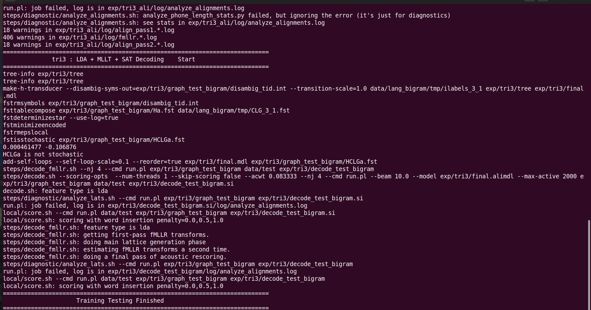
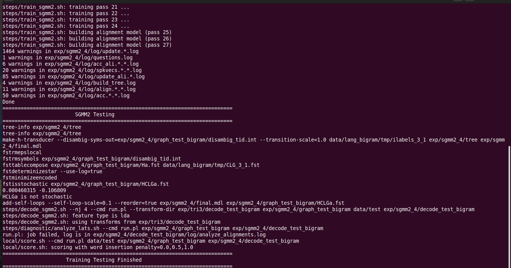
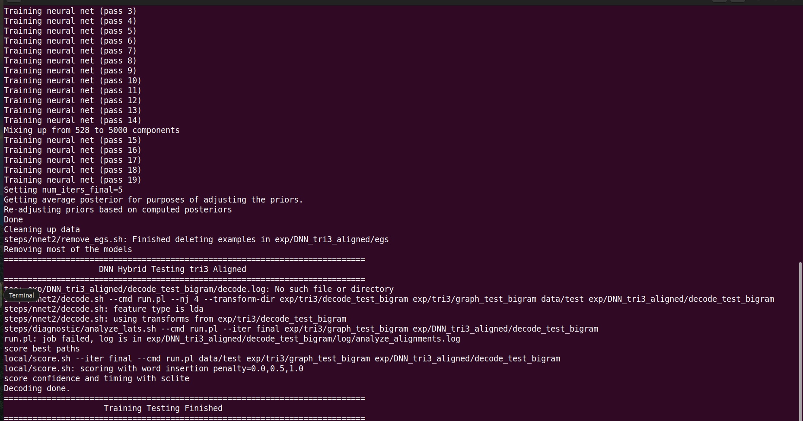

# Kaldi-ASR

**Author: Abhishek Dey**

Projects related to Automatic Speech Recognition using Kaldi Tool Kit

# Getting Started:

* Follow [KALDI_INSTALL.md](KALDI_INSTALL.md) for Kaldi Installation

# Building an ASR system:

* Create a workspace 

```
mkdir -p asr_workspace

```

* Copy all the scripts from [kaldi_scripts](kaldi_scripts) to **asr_workspace**

```

cp -r kaldi_scripts/* asr_workspace

cd asr_workspace/

```

## Dataset:

* Download sample assamese continuous speech dataset inside **asr_workspace** : [Google drive link](https://drive.google.com/file/d/1-Rm9PsV4McRY9-OQtyyibCRwPt0YQmTb/view?usp=drive_link)

* unzip dataset

```

unzip sample_assamese_cont_speech_data.zip

```

## Docker environment: 

* Docker run

```
docker run --gpus 0 -e NVIDIA_VISIBLE_DEVICES=0 --shm-size 4G -it --rm -v $PWD:/home/developer kaldiasr/kaldi:gpu-ubuntu20.04-cuda11-2024-12-02

```

* Install sgmm binaries

```
cd src/sgmm2

make

cd ../sgmm2bin/

make

```

* Install irstlm and srilm

```
cd tools

extras/install_irstlm.sh

extras/install_srilm.sh

```

## Prepare dataset:

* Change directory to /home/developer

```
cd /home/developer/

```

* make directories

```
mkdir -p data/train data/test data/local

```

### Create supporting files for train & test set

1. **Transcription (text)**

```
cp sample_assamese_cont_speech_data/train_text data/train/text

cp sample_assamese_cont_speech_data/test_text data/test/text

```

* for train set - cd data/train

* for test set - cd data/test

2. **utt2spk** – utterance to speaker mapping file

```
cat text | awk '{print $1}' | sort | uniq > utt

paste utt utt > utt2spk

```

3. **spk2utt** - speaker to utterance mapping file

```
../../utils/utt2spk_to_spk2utt.pl utt2spk > spk2utt

```

4. **trans** - only transcription file


```
cat text | sed 's/\t/@/g'| cut -d '@' -f2 > trans

```


5. **wav.scp** - utterance to wav mapping file

```
cd ../../

use wav_scp.sh <wav_path> <utt_path> <out_path>

```
* for train set:

```
./wav_scp.sh sample_assamese_cont_speech_data/wav data/train/utt data/train/wav.scp

```

* for test set:

```
./wav_scp.sh sample_assamese_cont_speech_data/wav data/test/utt data/test/wav.scp

```

## Prepare Bi-gram language model

* Copy **dict** folder inside data/local

```
cp -r sample_assamese_cont_speech_data/dict/ data/local/

```

* generate bi-gram lm

```
use : generate_ngram_lm.sh <kaldi_path> <base_path> <n_gram>

./generate_ngram_lm.sh /opt/kaldi /home/developer 2

```

<p align="left">

</p>


## MFCC Feature extraction:

* Enable **mfcc_extract_sw=1**

* Disable other switches

* Execute **./run.sh**

<p align="left">

</p>


## Monophone training & testing:

* Enable **mono_train_sw=1**

* Enable **mono_test_sw=1**

* Disable other switches

* Execute **./run.sh**

<p align="left">

</p>


## tri-1 (Deltas + Delta-Deltas) training & testing:

* Enable **tri1_train_sw=1**

* Enable **tri1_test_sw=1**

* Disable other switches

* Execute **./run.sh**

<p align="left">

</p>


## tri-2 (LDA + MLLT) training & testing:

* Enable **tri2_train_sw=1**

* Enable **tri2_test_sw=1**

* Disable other switches

* Execute **./run.sh**

<p align="left">

</p>

## tri-3 (LDA + MLLT + SAT) training & testing:

* Enable **tri3_train_sw=1**

* Enable **tri3_test_sw=1**

* Disable other switches

* Execute **./run.sh**

<p align="left">

</p>

## SGMM training & testing:

* Enable **sgmm_train_sw=1**

* Enable **sgmm_test_sw=1**

* Disable other switches

* Execute **./run.sh**

<p align="left">

</p>

## DNN training & testing:

* Enable **dnn_train_sw=1**

* Enable **dnn_test_sw=1**

* Disable other switches

* Execute **./run.sh**

<p align="left">

</p>

## Experimental Results: Word Error Rate (%WER)

* mono

```
cat exp/mono/decode_test_bigram/scoring_kaldi/best_wer 

%WER 7.78 [ 73 / 938, 2 ins, 49 del, 22 sub ] exp/mono/decode_test_bigram/wer_16_0.0

```

* tri1

```
cat exp/tri1/decode_test_bigram/scoring_kaldi/best_wer 

%WER 9.91 [ 93 / 938, 3 ins, 54 del, 36 sub ] exp/tri1/decode_test_bigram/wer_17_0.0

```

* tri2

```
cat exp/tri2/decode_test_bigram/scoring_kaldi/best_wer 

%WER 11.62 [ 109 / 938, 6 ins, 50 del, 53 sub ] exp/tri2/decode_test_bigram/wer_17_0.0

```

* tri3

```
cat exp/tri3/decode_test_bigram/scoring_kaldi/best_wer 

%WER 11.41 [ 107 / 938, 7 ins, 46 del, 54 sub ] exp/tri3/decode_test_bigram/wer_17_0.0

```

* sgmm

```
cat exp/sgmm2_4/decode_test_bigram/scoring_kaldi/best_wer 

%WER 44.14 [ 414 / 938, 71 ins, 74 del, 269 sub ] exp/sgmm2_4/decode_test_bigram/wer_14_1.0

```

* dnn

```
cat exp/DNN_tri3_aligned/decode_test_bigram/scoring_kaldi/best_wer 

%WER 14.71 [ 138 / 938, 18 ins, 63 del, 57 sub ] exp/DNN_tri3_aligned/decode_test_bigram/wer_17_0.0

```
